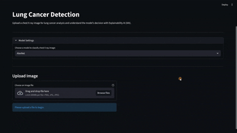
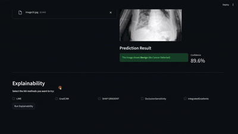
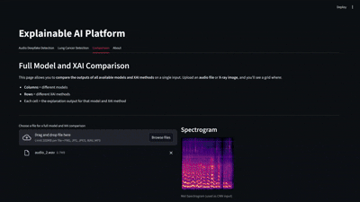

# **Unified Explainable AI Interface**
### *XAI Project*

---
## Group Members
- Lorrain MORLET
- Noémie MAZEPA
- Auriane MARCELINO

Class: **DIA2**

---

## Project Overview
This project aims to create a unified explainable (XAI) interface, allowing users to classify audio and image files with Deep Learning models but most importantly, analyze the results via XAI techniques to gain insights into the model's decisions.

The platform gives the possibility for users to either detect **audio deepfakes** or **detect lung cancer**:
- **Audio Deepfake Detection**: detects if an audio is real or not, using models like VGG16, MobileNet and ResNet. Audio files are first processed into spectrograms for a better performance.
- **Lung Cancer Detection**: detects malignant tumors in chest X-rays, using the fine-tuned AlexNet and DenseNet models.

The platform integrates XAI methods such as LIME, Grad-CAM, SHAP Kernel, Occlusion Sensitivity and Integrated Gradients to better understand the different models' predictions and have a better transparency in the models' decisions.

## Key Features
- Multi-modal support: audio (.wav and .mp3) and images (chest X-rays in .jpg, .jpeg and .png).
- Choice between several classification models for both tasks.
- Application of different XAI methods: LIME, Grad-CAM, SHAP Kernel, Occlusion Sensitivity, Integrated Gradients. 
- Automatic filtering of the proposed XAI techniques based on the input type.
- Web interface via Streamlit.

## Project Structure
```
XAI_Project
|
├── audio_files/
│   ├── specs/
│   │   ├── audio_1_spec.png
│   │   ├── audio_2_spec.png
│   │   ├── ...
│   │   └── audio_11_spec.png
│   ├── audio_1.mp3
│   ├── audio_1.wav
│   └── output.wav
│
├── models training/
│   ├── Audio_Deepfake_Detection_Notebooks/
│   │   └── train_audio_classifiers.ipynb
│   └── Lung_Cancer_Detection_Notebooks/
│       ├── Lung_Cancer_Detection_With_VAE.ipynb
│       └── Lung_Cancer_Detection_Without_VAE.ipynb
│   
├── image_files/
│   ├── image19.jpg
│   └── image19.png
│
├── img/
│   ├── full_comparison.gif
│   ├── interface_1.gif
│   ├── interface_2.gif
│   └── robot.gif
│
├── models/
│   ├── Lung_Cancer_Detection/
│   └── xai_audioclassifiers/
│
├── inference.py
├── app.py
├── xai_models.py
├── .gitignore
├── README.md
└── requirements.txt
```

## Audio Deepfake Detection
Users can upload an audio file, select a model, apply one or several XAI methods and look at the predictions with explanations.

- **Input**: Audio files (.wav, .mp3)

- **Models**: VGG16, MobileNet, ResNet

- **XAI**: LIME, SHAP Kernel, Grad-CAM (on spectrograms), Occlusion Sensitivity, Integrated Gradients


## Lung Cancer Detection
Users can upload chest X-rays in the form of an image, select a model, apply one or several XAI methods and inspect the areas of interest highlighted by each XAI model.

- **Input**: Chest X-ray images (.png, .jpg)

- **Models**: AlexNet, DenseNet

- **XAI**: Grad-CAM, LIME, SHAP Kernel, Occlusion Sensitivity, Integrated Gradients


## Technologies Used

- **Deep Learning Models**: 
    - *Audio Deepfake Detection*: VGG16, MobileNet, ResNet
    - *Lung Cancer Detection*: AlexNet, DenseNet
- **Explainable AI (XAI) Techniques**: LIME, Grad-CAM, SHAP Kernel, Occlusion Sensitivity, Integrated Gradients
- **Programming Languages and Libraries**: Python, TensorFlow, Keras, Matplotlib, NumPy, Librosa
- **Development Tools**: Jupyter Notebooks
- **Web Application Framework**: Streamlit

## Streamlit Web Application
The Streamlit interface allows users to interact with the tasks and models in a simple way:

- Choose the task (audie deepfake detection or Lung Cancer Detection)
- Upload an audio or image file based on the task
- Select the classification model
- Apply XAI methods
- Visualize results and explanations
- Compare multiple explainability outputs in a side-by-side comparison tab

#### Interface Examples



#### Full Comparison Tab


## Setup and Installation

**1. Clone the repository**
````
git clone https://github.com/Noemiemz/XAI_Project.git
cd XAI_Project
````

**2. Set up a virtual environment**
For Windows:
````
python -m venv venv
source venv\Scripts\activate
````

**3. Install dependencies**
````
pip install --upgrade pip
pip install -r requirements.txt
````
**Note**: Python 3.11 or below is recommended. Python 3.12 can cause compatibility issues.

**4. Download the pretrained classifier models weights**
This project uses several classifier models to make predictions. The weigths of those pretrained models are hosted in 2 Hugging Face repositories.

To ensure that the models load correctly when using the Streamlit application, these repositories need to be cloned locally and placed in the appropriate folders.

- **Lung Cancer Detection Models**
    Move to the directory `models/`:
    ```bash
    cd models
    ```
    Clone the repository containing the pretrained AlexNet and DenseNet weights:
    ```
    git clone https://huggingface.co/nomiemzp/Lung_Cancer_Detection
    ```

- **Audio Deepfake Detection Models**
    Clone the repository containing the pretrained AlexNet and DenseNet weights:
    ``` 
    git clone https://huggingface.co/Nasotro/xai_audioclassifiers
    ```


**Note**: the folder structure and location must match the paths expected in the Streamlit application (`Streamlit/app.py` file) or need to be updated in the code.


**5. Run the Streamlit application**
````
streamlit run Streamlit/app.py
````
Open the URL shown in the terminal in your web browser (ex: http://localhost:8503)

---
## Generative AI Usage Statement

#### Report
We used generative AI (Mistral) in the report especially for the presentation of the XAI methods. Indeed, we made some researches at the beginning of the project about the several XAI methods we could use and we kept the answers to write this report.
We also use generative AI (Mistral) for the Challenges part to avoid making mistake about the technical vocabulary. We write a text about the challenges and ask to mistral to correct if some terms were not well employed.

#### Code
For the code, we used ChatGPT and Mistral to support us while coding. It was mainly to help us move forward when we had difficulties but also to gain time.
- For the lung cancer detection and audio classifier trainings, we used AI for the processing of the dataset to get training and validation data as close as to what was described, the construction of the Variational Autoencoder and CVAE but also to help with the model training and tuning of parameters. We had to adapt the original paper to our limited resources. 
- For the Streamlit interface, we used AI to help with the design of the application. It was helpful to quickly get the hang of the different functions used in Streamlit and to quickly get a satisfying interface. We always had the ideas and we knew exactly what we wanted to do and how but then the AI made us gain time to actually implement it.
- For the XAI methods, we used it especially for the SHAP implementation which was very difficult to implement correctly. It also helped adapt the explainability functions to the different frameworks we used: when handling models saved in different format for example (Tensorflow in .h5 and PyTorch in .pth). overall, after choosing the XAI methods we wanted to use, we used AI to help the implementation. 
- Overall, AI was used to debug, understand the errors and help with the whole implementation.
  
#### Readme
We generate the project structure using Mistral and giving it screenshots of the project structure. We decided to use generative AI for this task because we thought it was a task that just requires rewriting some names, that can last few times and doesn’t require specific thinking.
We also used it for some sections to write a clear setup for example or to have a more concise phrasing.


